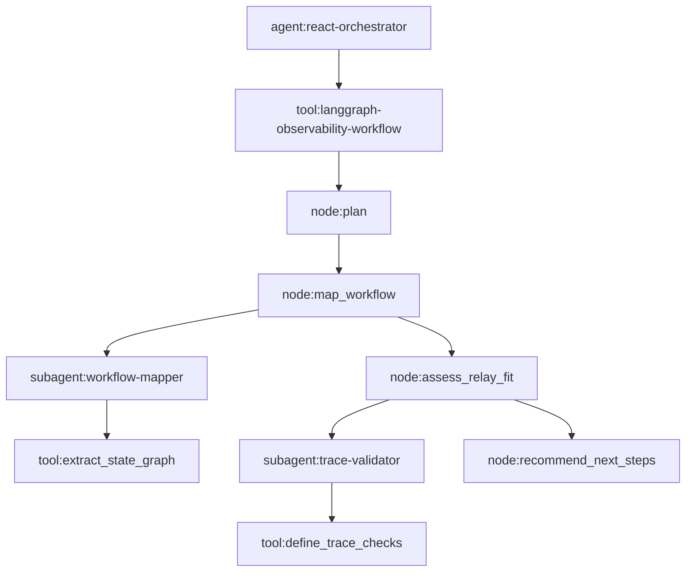

# Middleware-Based Workflow Mapping

This prototype models a small deterministic state graph:

The important validation rule is hierarchy, not only event presence. The expected
shape is:

1. Custom Python React-loop orchestrator opens the root agent scope.
2. The LangGraph workflow runs as a tool scope under that root.
3. Each deterministic graph node opens a `node:*` Relay scope.
4. Subagents and tools are nested under the node that owns the work.
5. The emitted ATOF events contain parent UUIDs that prove the trace is not flat.
