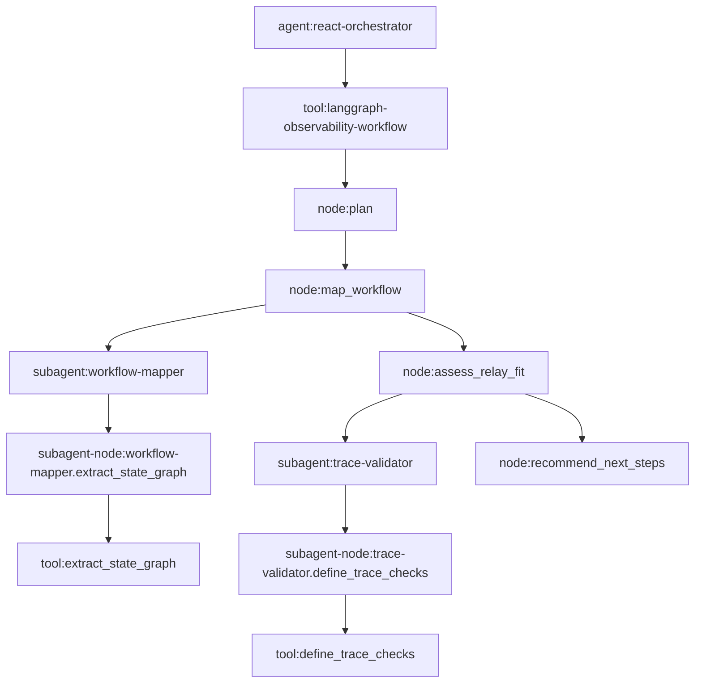

# Middleware-Based Workflow Mapping

This prototype models a small deterministic state graph:

The important validation rule is hierarchy, not only event presence. The expected
shape is:

1. Custom Python React-loop orchestrator opens the root agent scope.
2. The LangGraph workflow runs as a tool scope under that root.
3. Each deterministic graph node opens a `node:*` Relay scope.
4. Each subagent is a compiled LangGraph subgraph invoked inside the parent node.
5. Each subagent graph opens a `subagent-node:*` Relay scope for its deterministic node.
6. Tools are nested under the subagent graph node that owns the call.
7. The emitted ATOF events contain parent UUIDs that prove the trace is not flat.
